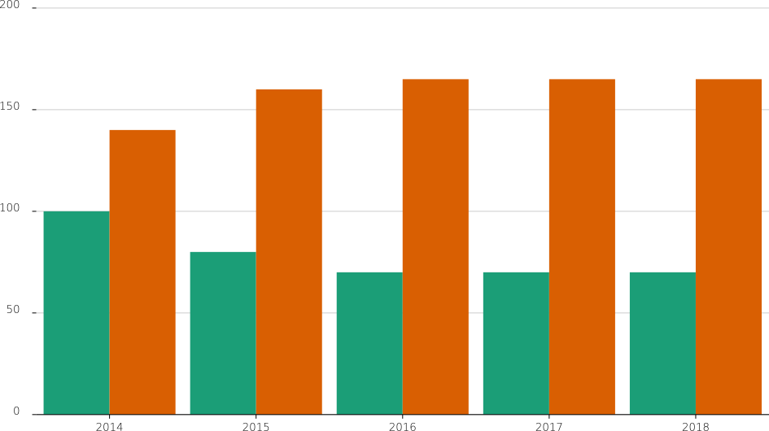

# h3 

Extensible data visualisation in Haskell. 

"Extensible" means that the main feature of this library is a type class `Scalable` that specifies how scales (configurable functions) can be constructed. A number of instances are provided in `Data.H3.Scales`, `Data.H3.Visuals`, `Data.H3.Geo.Projection` and `Data.H3.Colour`. Scales can be combined using the combinators in `Data.H3.Scales` and new instances are easy to implement. The `h3-examples` project contains some examples. 

# License

MIT (see LICENSE file)
